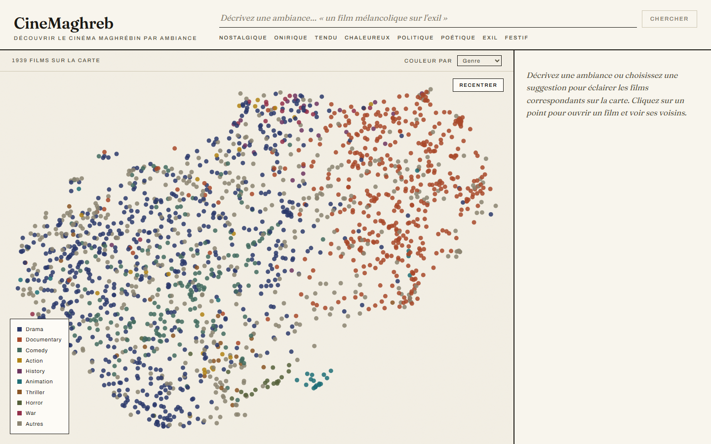
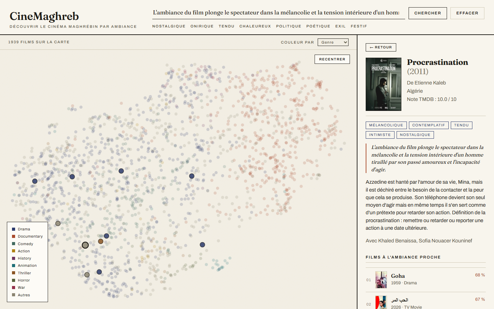

# CineMaghreb

**Search a film catalogue by atmosphere, not by keyword.** Type *"a melancholic film about exile
and returning home"* and the 1,939 mapped films rearrange around your phrasing — no tags typed, no
genre dropdown.



*[Version française ci-dessous](#cinemaghreb-fr)*

---

## What it does

CineMaghreb indexes Maghrebi cinema (Morocco, Algeria, Tunisia, Libya, Mauritania) and makes it
explorable by mood. Two entry points into the same semantic space:

- **Free-text search** — a natural-language description is embedded and matched against the
  catalogue by cosine similarity. Matching films light up on the map.
- **The map itself** — every film is a point, placed so that films with a similar atmosphere sit
  close together. Click one to open it and see its nearest neighbours.



Current catalogue: **1,965 films collected, 1,939 with a synopsis and a position on the map.**

## How it works

The design hinges on one split: **what is computed once, offline, and what answers in real time.**

```
TMDB API ──▶ CSV ──▶ SQLite ──▶ Gemini tagging ──▶ embeddings ──▶ Chroma + UMAP
                                                                        │
                                          browser ◀── React ◀── FastAPI ┘
```

Everything left of the arrow runs ahead of time as a pipeline. A search only has to embed one short
sentence and run a vector lookup, which is why an ML-backed search feels instant.

### Details worth a look

**Multilingual embeddings.** The catalogue mixes French, Arabic and English synopses, so the index
uses `paraphrase-multilingual-mpnet-base-v2`. A French query matches an Arabic synopsis without any
translation step.

**Atmosphere before plot.** The text handed to the embedding model is assembled deliberately —
mood summary first, then tags, genres, and only then the synopsis
([`text_builder.py`](backend/app/embeddings/text_builder.py)). Leading with atmosphere is what makes
the search return films that *feel* alike rather than films with similar plots.

**A controlled vocabulary, enforced at the API level.** Ambiance tags come from a fixed list of 24
French adjectives. Rather than trusting the model to comply, the request constrains `tags` to that
enum through Gemini's structured-output schema, and the response is filtered against the list again
on the way in ([`ambiance_tagger.py`](backend/app/enrichment/ambiance_tagger.py)).

**A pipeline that survives its own quota.** Gemini's free tier allows 20 requests per day *per
model*. The enrichment run therefore walks several models to spend each allowance, orders films by
popularity so the daily budget goes to the ones people actually search for, commits every 20 films
so an interrupted run keeps its work, and stops after five consecutive API errors instead of burning
the remaining list against a spent quota. Re-running it simply resumes.

**Neighbourhood-preserving projection.** UMAP compresses 768 dimensions to 2 for the map. Its
`n_neighbors` scales with catalogue size ([`projection.py`](backend/app/embeddings/projection.py)) —
the library default blurs small groups together on a small corpus. Read the map as *proximity*:
neighbouring points are meaningfully alike, but the distance between two far-apart clusters means
nothing.

**Degrades gracefully.** Tagging is the slowest stage, so nothing depends on it. A film needs only a
synopsis to be embedded, mapped and searchable; tags enrich the result when present.

## Stack

| Layer | Choice |
|---|---|
| API | FastAPI, Pydantic |
| Database | SQLAlchemy over SQLite (swap `DATABASE_URL` for PostgreSQL) |
| Embeddings | sentence-transformers |
| Vector store | Chroma |
| Projection | UMAP |
| Tagging | Google Gemini, structured output |
| Frontend | React 19, TypeScript, Vite |
| Map | D3 (scales and zoom only — React renders the SVG) |
| Tests | pytest — 52 tests |

## Running it

Needs Python 3.12 and Node. A free [TMDB key](https://www.themoviedb.org/settings/api) is required;
a free [Gemini key](https://aistudio.google.com/app/apikey) is optional and only enables tagging.

```bash
cp .env.example backend/.env      # then fill in TMDB_API_KEY
cd backend
uv sync                            # or: pip install -e .

python -m app.data_collection.run_pipeline --countries maghreb --skip-imdb
python -m app.data_collection.load_to_db
python -m app.enrichment.run_enrichment     # optional, needs GEMINI_API_KEY
python -m app.embeddings.build_index        # first run downloads ~1 GB model

python -m uvicorn app.api.main:app          # API on :8000, docs at /docs
```

```bash
cd frontend && npm install && npm run dev   # UI on :5173
```

The collected data, the database and the vector store are not in the repository — the pipeline
rebuilds them. `--skip-imdb` avoids a multi-gigabyte bulk download; TMDB alone yields 98.7% synopsis
coverage.

Film metadata comes from [TMDB](https://www.themoviedb.org/), which does not endorse this project.

---

<a name="cinemaghreb-fr"></a>

# CineMaghreb — version française

**Chercher un film par son atmosphère, pas par mot-clé.** Tapez *« un film mélancolique sur l'exil
et le retour au pays »* et les 1 939 films de la carte se réorganisent autour de votre phrase —
sans tag à saisir, sans menu de genres.

## Ce que fait le projet

CineMaghreb indexe le cinéma maghrébin (Maroc, Algérie, Tunisie, Libye, Mauritanie) et le rend
explorable par ambiance. Deux entrées vers le même espace sémantique :

- **La recherche en langage libre** — votre description est transformée en vecteur et comparée au
  catalogue par similarité cosinus. Les films correspondants s'allument sur la carte.
- **La carte** — chaque film est un point, placé de sorte que les films d'ambiance proche soient
  voisins. Un clic ouvre la fiche et met en évidence les films les plus proches.

Catalogue actuel : **1 965 films collectés, 1 939 avec synopsis et position sur la carte.**

## Comment ça marche

Toute la conception repose sur une distinction : **ce qui est calculé une fois, hors ligne, et ce
qui répond en direct.** La chaîne TMDB → CSV → SQLite → tags Gemini → embeddings → Chroma + UMAP
tourne à l'avance. Une recherche n'a plus qu'à encoder une phrase courte et interroger l'index
vectoriel, d'où l'impression d'instantanéité malgré l'IA sous-jacente.

### Points de conception

**Embeddings multilingues.** Le catalogue mêle synopsis français, arabes et anglais : le modèle
`paraphrase-multilingual-mpnet-base-v2` permet à une requête française de trouver un synopsis arabe
sans étape de traduction.

**L'ambiance avant l'intrigue.** Le texte soumis au modèle est assemblé dans un ordre voulu —
résumé d'ambiance, puis tags, genres, et seulement ensuite le synopsis. C'est ce qui fait remonter
des films qui *se ressemblent* plutôt que des films au scénario voisin.

**Vocabulaire contrôlé, imposé au niveau de l'API.** Les tags proviennent d'une liste fixe de 24
adjectifs. Plutôt que d'espérer que le modèle s'y tienne, la requête contraint le champ `tags` à
cette énumération via la sortie structurée de Gemini, et la réponse est re-filtrée à la réception.

**Un pipeline qui survit à son propre quota.** Le palier gratuit de Gemini autorise 20 requêtes par
jour *et par modèle*. L'enrichissement parcourt donc plusieurs modèles pour épuiser chaque
allocation, traite les films par popularité décroissante, enregistre tous les 20 films pour qu'une
interruption ne perde rien, et s'arrête après cinq erreurs consécutives au lieu d'épuiser la liste
contre un quota mort. Relancer la commande reprend où elle s'était arrêtée.

**Projection qui préserve le voisinage.** UMAP réduit 768 dimensions à 2. Son paramètre
`n_neighbors` s'adapte à la taille du catalogue, la valeur par défaut brouillant les petits groupes
sur un corpus réduit. La carte se lit en termes de *proximité* : des points voisins se ressemblent
vraiment, mais la distance entre deux amas éloignés ne signifie rien.

**Dégradation progressive.** Le tagging étant l'étape la plus lente, rien n'en dépend : un synopsis
suffit pour qu'un film soit indexé, placé et trouvable. Les tags enrichissent quand ils sont là.

## Lancer le projet

Python 3.12 et Node requis. Une clé [TMDB](https://www.themoviedb.org/settings/api) gratuite est
nécessaire ; une clé [Gemini](https://aistudio.google.com/app/apikey) est facultative et ne sert
qu'au tagging. Les commandes figurent dans la section anglaise ci-dessus.

Les données collectées, la base et l'index vectoriel ne sont pas versionnés : le pipeline les
reconstruit. L'option `--skip-imdb` évite un téléchargement de plusieurs gigaoctets, TMDB seul
couvrant 98,7 % des synopsis.

Les métadonnées proviennent de [TMDB](https://www.themoviedb.org/), qui ne cautionne pas ce projet.
